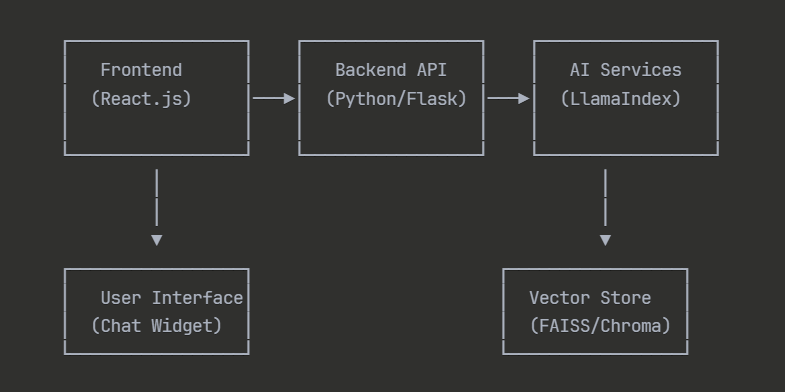

# AI Chatbot cho Trường Học - Hệ thống Hỏi Đáp Thông Minh
> Hệ thống chatbot AI tích hợp công nghệ RAG (Retrieval Augmented Generation) và LlamaIndex để tự động trả lời các câu hỏi về nhà trường, hỗ trợ học sinh và phụ huynh 24/7.

## Tính năng chính

- 🤖 **Chatbot thông minh**: Sử dụng RAG và LlamaIndex để cung cấp câu trả lời chính xác
- 📚 **Cơ sở tri thức đầy đủ**: Crawl và xử lý dữ liệu từ website trường học
- 🌐 **Giao diện thân thiện**: Website responsive với chat interface trực quan
- 🔍 **Tìm kiếm ngữ nghĩa**: Vector search để tìm thông tin liên quan nhất
- 📊 **Phân tích và theo dõi**: Thống kê hiệu suất và feedback của người dùng
- 🔒 **Bảo mật dữ liệu**: Tuân thủ các tiêu chuẩn bảo mật giáo dục

## Kiến trúc hệ thống


Hệ thống crawl dữ liệu từ website trường học, tạo embeddings với LlamaIndex, lưu trữ trong vector database, và sử dụng RAG để trả lời câu hỏi của người dùng một cách thông minh và chính xác.

## Công nghệ sử dụng

### Backend
- **Python 3.8+**: Ngôn ngữ lập trình chính
- **Flask/FastAPI**: Web framework cho API
- **LlamaIndex**: Framework cho RAG implementation
- **Gemini API**: Large Language Model cho text generation

### Frontend
- **React.js**: Frontend framework
- **HTML/CSS/JavaScript**: Công nghệ web cơ bản

### VectorDB trong LLM
- **FAISS**: Vector database cho semantic search

### AI/ML Components
- **Sentence Transformers**: Tạo embeddings cho documents
- **BAAI/bge-base-en-v1.5**: Embedding model
- **gemini-2.5-flash**: Language model cho response generation

## Cài đặt

### 1. Clone repository
```bash
git clone https://github.com/PhamVanHung412004/Build-a-website-with-integrated-AI-Chatbot-technology-to-ask-and-answer-questions-about-the-school.git
cd Build-a-website-with-integrated-AI-Chatbot-technology-to-ask-and-answer-questions-about-the-school
```

### 2. Cài đặt Backend
```bash
# Tạo môi trường với conda (yêu cầu Miniconda or Anaconda)
conda create -n tên_môi_trường python=3.10
```

```bash
#khởi động môi trường ảo
conda activate tên_môi_trường
```
## Cấu hình
### 1. Environment Variables
Tạo file `.env` trong thư mục root:
```bash
# Gemini API
Nếu dùng windows
set GEMINI_API_KEY="Thay bằng API key của bạn"

Nếu dùng ubuntu
export GEMINI_API_KEY= "Thay bằng API của bạn"
```

## Hướng dẫn sử dụng

### 1. Crawl dữ liệu từ website trường
```bash
# Chạy web crawler để thu thập dữ liệu
python craw_data/run.py
```

### 2. Khởi động Backend
```bash
# Chạy Flask API server
python backend/main.py

# Server sẽ chạy tại: http://localhost:5000
```

### 3. Khởi động Frontend
```bash
chạy file index.html
```

### 4. Sử dụng Chatbot
1. Truy cập https://phamvanhung412004.github.io/Build-a-website-with-integrated-AI-Chatbot-technology-to-ask-and-answer-questions-about-the-school/

2. Nhập câu hỏi vào chat interface
3. Hệ thống sẽ tự động tìm kiếm thông tin liên quan và trả lời

## API Documentation

### Chat Endpoints

#### POST /api/chat
Gửi tin nhắn đến chatbot
```json
{
  "message": "Học phí của trường là bao nhiêu?"
}
```

Response:
```json
{
  "response": "Học phí của trường BTEC FPT năm học 2024-2025 là...",
}

```
### Response Generation
Hệ thống sẽ:
1. Tìm kiếm documents liên quan nhất dựa trên semantic similarity
2. Trích xuất context từ top-k documents
3. Sử dụng LLM để sinh câu trả lời dựa trên context
4. Trả về response kèm theo nguồn tham khảo

## Liên hệ

- **Developer**: Phạm Văn Hưng
- **Email**: phamvanhung412004@gmail.com
- **GitHub**: [@PhamVanHung412004](https://github.com/PhamVanHung412004)

## Acknowledgments

- Gemini cho Gemini API
- LlamaIndex community
- BTEC FPT University cho data source
- Các contributor và tester

---

*Phát triển với ❤️ để hỗ trợ giáo dục thông minh*